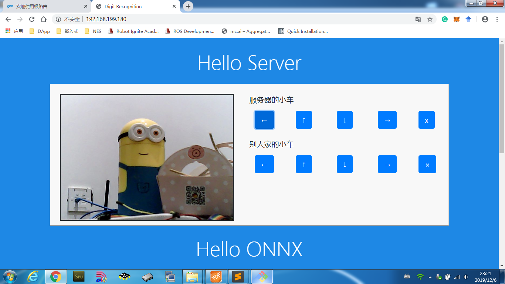
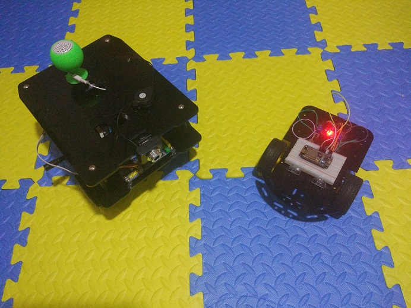
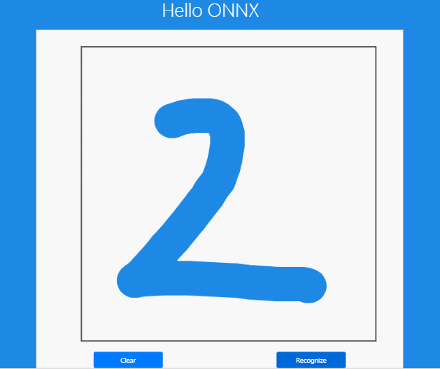

# 奔跑的服务器

这是一辆可以奔跑的网站服务器，下面图片上的网站本身就是搭建在小车上的。

除了可以控制搭载 RT-Thread 本身的小车，也可以在网页上控制其他的小车。

这就是 2 辆小车的全照。

另外，小车上还保存了通用机器学习 onnx 模型，可以在线进行手写体识别，根据识别的结果做出控制。

- 实现功能：一辆搭载网站服务器的小车，可以在网站上远程控制，通过摄像头看到小车视野的景象，同时还可以控制其他的小车，并且加载了通用机器学习 onnx 模型，可以根据手写体识别的结果做出控制。

- 软件框架：RT-Thread 使用 Webnet 软件包搭建网站服务器，通过 HTTP 请求控制其他小车，并获取小车上树莓派连接的摄像头信息，同样也是 HTTP POST 把网站上写的字提交到小车上进行识别，并返回结果。

- 官方软件包：EasyFlash，FAL，Netutils，Webnet，STM32_SDIO

- 个人软件包：protobuf-c，onnx-backend，onnx-parser，i2c-tools，rt-u8g2

### 联系方式

- 维护：Wu Han
- 主页：[http://wuhanstudio.cc](http://wuhanstudio.cc/)
- 联系：<https://github.com/wuhanstudio/rtt-car/issues>
