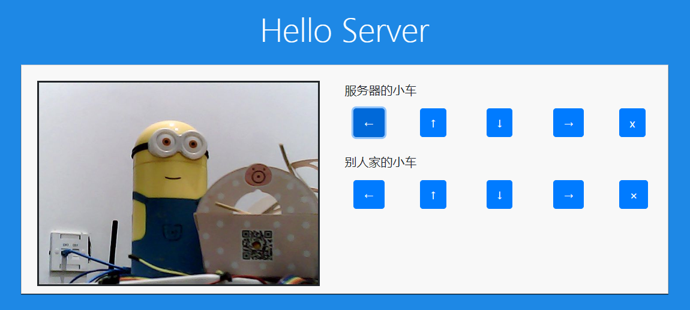
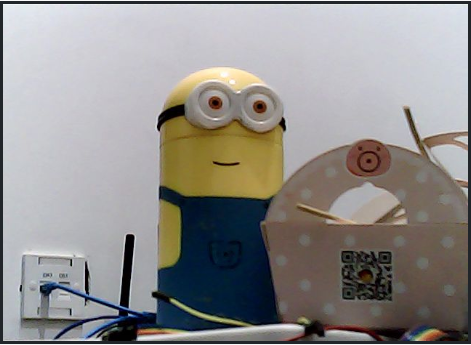
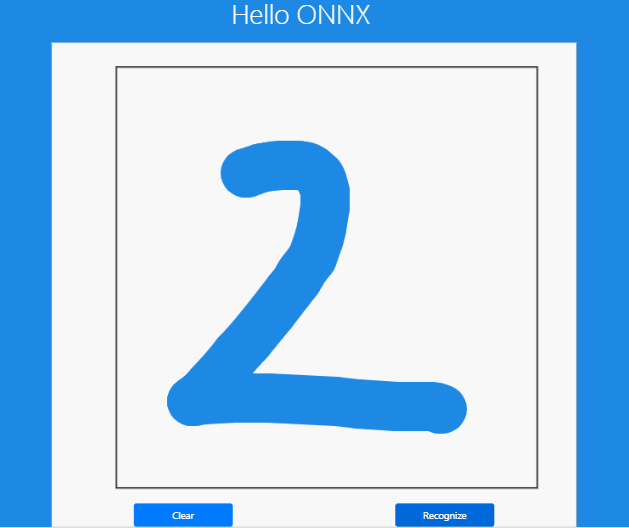

# 奔跑的服务器

这篇文档会介绍这个项目是如何实现的，主要实现的功能有**远程控制(RT-Thread)**，**远程摄像头(Linux)**，**在线手写体识别(RT-Thread)**，下面会分别在每个部分介绍。借这个项目也是想尝试一下，把 实时系统 (RTOS)，网站服务器 (Web Server)，和机器学习模型推断 (onnx) 这些功能放在一起一共需要多少的 Flash 和 RAM 资源。

### 远程控制 (RT-Thread)

下面图像上右边的小车控制，其实是 HTTP POST 请求实现的，这一部分代码在 tf_card 文件夹下的 JavaScript 源码里。



当按钮按下时，会发送小车前进的 POST 请求；当按钮抬起时，会发送小车停止的请求。

```Javascript
// 根据 ID 获取按钮
var btn_run = document.getElementById('btn_run');
// 注册鼠标按下事件
obtn_run.addEventListener('mousedown', orobot_run);
// 注册鼠标抬起事件
obtn_run.addEventListener('mouseup', orobot_stop);
```

而对应的事件处理则是发送对应的 HTTP 请求。

```
function robot_run() {
    var url = window.location.href + "cgi-bin/robot_run";
    var xmlHttp = new XMLHttpRequest();
    console.log(url);
    xmlHttp.onreadystatechange = function() {
        if (xmlHttp.status == 200){
            // alert(xmlHttp.responseText);
        }
        else{
            // alert('Error');
        }
    }
    xmlHttp.open("GET", url, true); // true for asynchronous
    xmlHttp.send(null);
}
```

这里用的是原生 Javascript 实现的，当然用其他的库函数例如 axios 也是可以的，不过考虑到这个网站本身是搭建在 STM32L4 上的，无论是响应速度还是内存都不能和服务器相比，因此尽可能使用了一些轻量级的实现。

当浏览器发出 POST 请求后，小车上的服务器当然也要做出响应，这里是使用 RT-Tread 提供的 Webnet 软件包实现的，代码在 firmware 里的 webnet 应用中。

首先服务器需要注册对应的请求处理。

```
webnet_cgi_register("robot_run", cgi_robot_run_handler);
```

然后在对应的处理函数里实现小车的控制。

```C
static void cgi_robot_run_handler(struct webnet_session* session)
{
    msh_exec("robot_run", rt_strlen("robot_run"));
    const char* mimetype;
    static const char* status = "ok";

    /* get mimetype */
    mimetype = mime_get_type(".txt");

    /* set http header */
    session->request->result_code = 200;
    webnet_session_set_header(session, mimetype, 200, "Ok", strlen(status));
    webnet_session_write(session, (const rt_uint8_t*)status, rt_strlen(status));
}
```

之前提到，除了控制搭载服务器本身的小车，也可以控制其他的小车，这也同样是使用 HTTP POST 实现的，例如 ESP8266 也有对应的 HTTP 请求框架。

### 远程摄像头 (Linux)

摄像头部分则是由小车上的树莓派处理的，这里用到了 [mjpg-streamer](https://github.com/jacksonliam/mjpg-streamer) 软件，在 github 上 clone 对应的源码后。

```
$ cd mjpg-streamer
$ make clean all
$ export LD_LIBRARY_PATH=.
$ ./start.sh
```

 如果一切正常的话，在树莓派 ip 地址的 8080 端口就可以看到摄像头的试试数据了，如果想把视频流嵌入到自己的网站里。

```

```

把上面的 IP 改成自己的小车实际 IP，嵌入到自己的网站 HTMP 里就可以看到试试的图像数据了。



### 在线手写体识别(RT-Thread)

与小车控制相同，手写体识别也是浏览器首先把网站上绘制的数字转换为 28x28 的数组，利用 HTTP POST 发送到 RT-Thread 的网站服务器，然后 RTT 负责加载对应的 onnx 模型进行推断 (inference)，将模型识别得到的结果用 HTTP Response 返回给浏览器显示。



onnx 模型的加载和推断这里用到了 onnx-backend 软件包，由于 onnx 模型本身是 protobuf 格式，所以还需要对应的两个依赖软件包 protobuf-c 和 onnx-parser，而模型的训练则是使用 Keras，训练完成后将 Keras 的 h5 模型转换为 onnx 模型。

### 总结

最后 实时系统 (RTOS)，网站服务器 (Web Server)，和机器学习模型推断 (onnx) 加在一起，在没有开启优化选项的情况下，一共花费了 358 KB Flash， 48 RAM (不包括动态内存消耗)，感觉还是挺不错的 ;)

